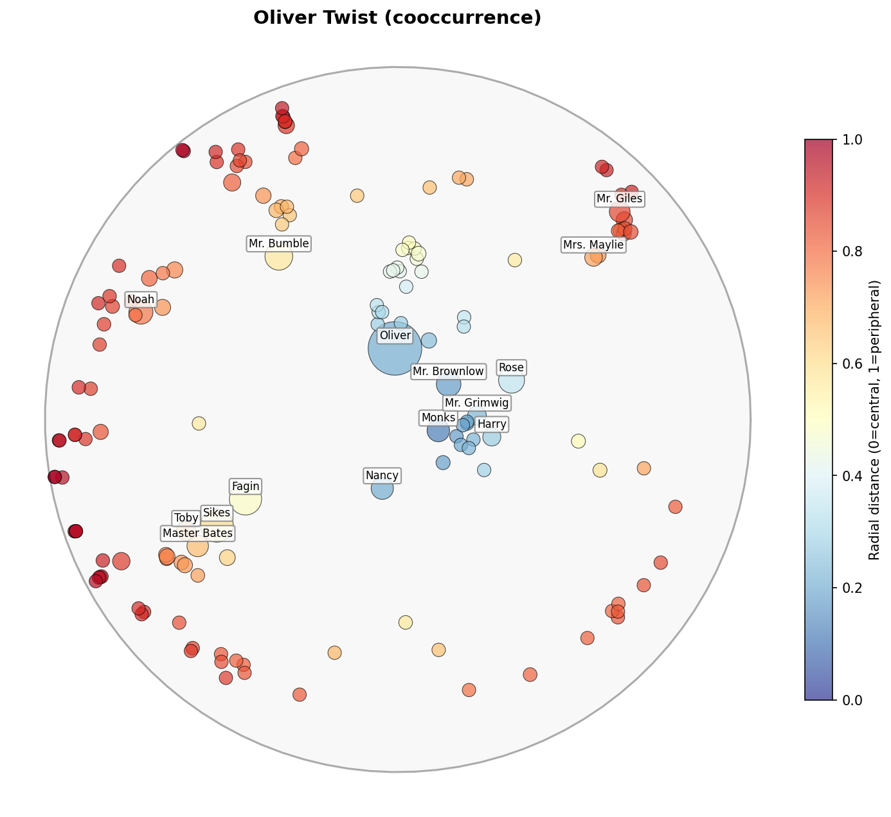

<p align="center">
  
</p>

# Computational Representations of Character in Classic English Novels

This repository contains all code, scripts, and instructions to reproduce the experiments and analyses presented in our paper.  
We provide code for:
- **Text preprocessing**  
- **BookNLP and LLM tagging pipelines**  
- **Graph construction and network analysis**  
- **Constructed Character Networks (3 methods) and Poincaré Embeddings**  
- **Statistical analysis & visualization**
---

## Directory Structure

```
tagging-gutenberg/
├── src/                         # Source code
├── data/                        # BookNLP outputs, corpus level information
├── notebooks/                   # Additional notebooks
├── requirements.txt             # Dependency specification
├── .gitignore
└── README.md
```

---

## Environment Setup

```bash
git clone https://github.com/haarisamian/tagging-gutenberg.git
cd tagging-gutenberg
pip install -r requirements.txt
python -c "import nltk; nltk.download('verbnet')"
```

---

## Data

For convenience, BookNLP outputs for the corpus are stored in data/smaller_corpus/, all downstream outputs in the pipeline, corpus-level tagging and network analysis, use these files.

---

## Analysis

To reproduce statistical analyses and figures from the paper, please view src/

All dependencies for analysis are included in `requirements.txt`.

## Contact

For questions or collaboration, please contact:  
📧 **ham2176@columbia.edu** or **mss2290@columbia.edu**
